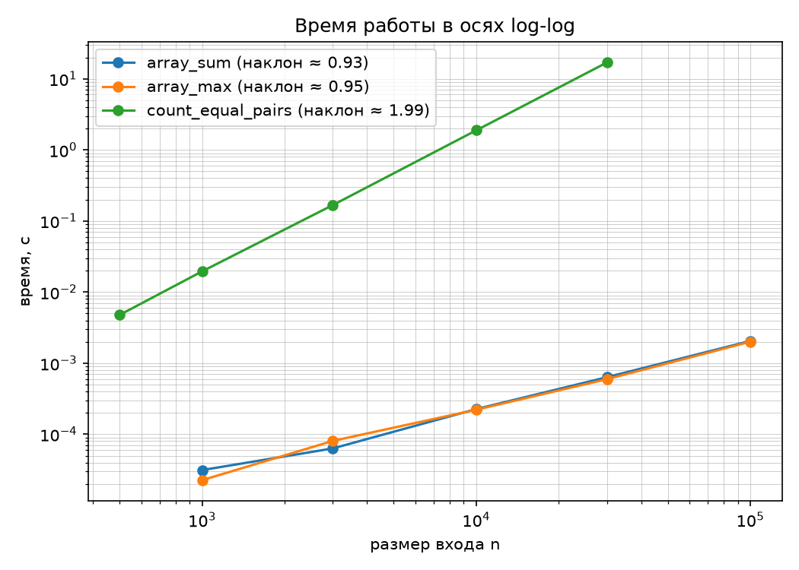
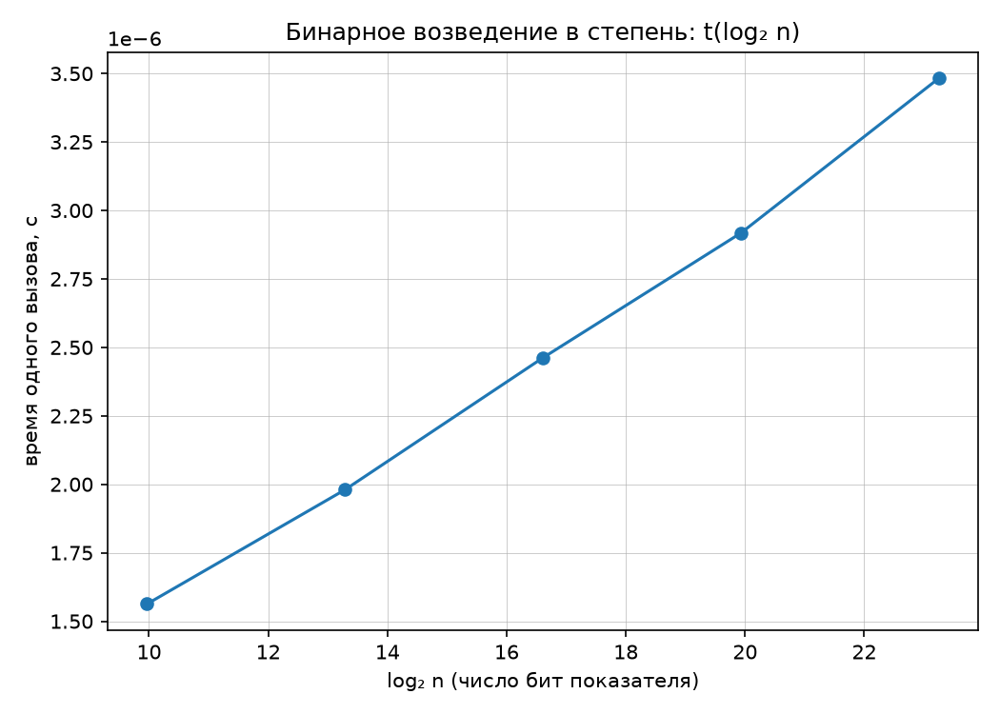

# ЛР-1. Структуры и алгоритмы обработки данных

**Студент:** Велибеков Нариман Сабирович  
**Группа:** БВТ2503  
**Вариант:** 5 (seed=35)  

---

## 1. Запуск
### Сгенерировать тестовый набор
```bash
python scripts/generate_data.py --variant 5 --only arrays
```
### Запустить все тесты
```bash
python M1-intro-and-basic-structures/attachments/lab01-complexity-starter.py --variant 5
```

---

## 2. Описание

| Алгоритм | Оценка времени | Обоснование |
| :--- | :--- | :--- |
| `array_sum` | $O(n)$ | Один проход по массиву, выполняется n операций сложения. |
| `array_max` | $O(n)$ | Один проход, n−1 сравнений. |
| `count_equal_pairs` | $O(n^2)$ | Вложенные циклы: внешний n итераций, внутренний в среднем n/2 → n(n−1)/2 ≈ n²/2 сравнений. |
| `binary_pow` | $O(\log n)$ | На каждой итерации показатель n делится пополам ( `n //= 2` ), цикл выполняется log₂(n) раз. |

---

## 3. Результаты бенчмарков

## Линейные алгоритмы

| $n$ | array_sum, с | array_max, с |
| :--- | :--- | :--- |
| 1000 | 0.000024 | 0.000022 |
| 3000 | 0.000064 | 0.000061 |
| 10000 | 0.000212 | 0.000203 |
| 30000 | 0.000639 | 0.000607 |
| 100000 | 0.002044 | 0.002056 |

## Квадратичный алгоритм

| $n$ | count_equal_pairs, с |
| :--- | :--- |
| 500 | 0.004669 |
| 1000 | 0.019075 | 
| 3000 | 0.167975 | 
| 10000 | 1.830229 | 
| 30000 | 17.171671 | 

## Логарифмический алгоритм

| $n$ | $O(\log n)$ | binary_pow, с |
| :--- | :--- | :--- |
| 1000 | 10.0 | 0.000001550 |
| 10000 | 13.3 | 0.000001998 |
| 100000 | 16.6 | 0.000002479 |
| 1000000 | 19.9 | 0.000002898 |
| 10000000 | 23.3 | 0.000003478 |

---

# 4. Графики


*Рис. 1. Зависимость времени от размера входа в логарифмических осях. Наклоны: array_sum ≈ 1.0, array_max ≈ 1.0, count_equal_pairs ≈ 2.0.*


*Рис. 2. Зависимость времени одного вызова binary_pow от $log₂(n)$. Видна линейная зависимость от числа бит показателя.*

---

# 5. Оценка результатов

### Сопоставление наклонов с теорией
`array_sum`: наклон **0.974** → подтверждает $O(n)$. (небольшое отклонение)
`array_max`: наклон **0.989** → подтверждает $O(n)$. (небольшое отклонение)
`count_equal_pairs`: наклон **2.000** → подтверждает $O(n²)$.

**Заметно небольшое расхождение из-за:**
- издержек интерпретации динамического кода
- кэширования данных процессором
- фоновых процессов ОС

### Почему для binary_pow не используется log-log?

**Проблема двойного логарифма (Log-Log):**  
При логарифмировании обеих осей зависимость времени $t = c \cdot \log n$ принимает вид:
$$\log(t) = \log(c) + \log(\log n)$$
Функция $\log(\log n)$ растёт чрезвычайно медленно, из-за чего кривая на графике вырождается в практически горизонтальную линию. На глаз становится невозможно отличить $O(\log n)$ от $O(1)$ или $O(\log \log n)$.

### Почему замер binary_pow выполняется по модулю?
Для оценки чистой сложности алгоритма `binary_pow` вычисления вводятся по модулю $m$ (в частности, $m = 10^9 + 7$). При обычных вычислениях $a^b$ итоговое значение и промежуточные операнды увеличиваются по длине экспоненциально, вынуждая Python задействовать алгоритмы длинной арифметики. В результате время каждой отдельной операции умножения перестает быть константным $O(1)$, а график начинает отражать вычислительные затраты на перемножение многозначных чисел. Фиксация значений рамками модуля удерживает операнды в пределах 30 бит, гарантируя строгое выполнение операций за $O(1)$, благодаря чему замеры времени показывают исключительно количество итераций самого цикла - $O(\log n)$.

---

# 6. Верификация
### Репрезентативные тесты
- Пустой массив: `array_sum([]) = 0`, `count_equal_pairs([]) = 0`.
- Один элемент: `array_sum([7]) = 7`.
- Все элементы равны: `count_equal_pairs([5,5,5]) = 3` (пары (0,1), (0,2), (1,2)).
- Нулевая степень: `binary_pow(2, 0) = 1`.
- Степень с модулем: `binary_pow(2, 10, mod=1000) = 24`.

### Сверка с эталонными реализациями
- `array_sum(a) == sum(a)` на 200 случайных массивах.
- `array_max(a) == max(a)` на 200 случайных массивах.
- `binary_pow(x, n, mod=POW_MOD) == pow(x, n, POW_MOD)` на 200 случайных парах (x, n).

### Собственные инварианты
- Сумма последовательных элементов → `array_sum([1, 2, 3, 4]) == 10` (корректность аккумуляции).
- Максимум среди элементов → `array_max([1, 7, 3, 4]) == 7` (поиск наибольшего значения).
- Уникальные элементы → `count_equal_pairs([1, 2, 3, 4]) == 0` (отсутствие совпадений).
- Все элементы идентичны → `count_equal_pairs([7, 7, 7, 7]) == 6`
- Модульное возведение в степень → `binary_pow(5, 3, mod=7) == pow(5, 3, 7)` (эквивалентность системной функции).

**Результат:** `self_check: OK`.